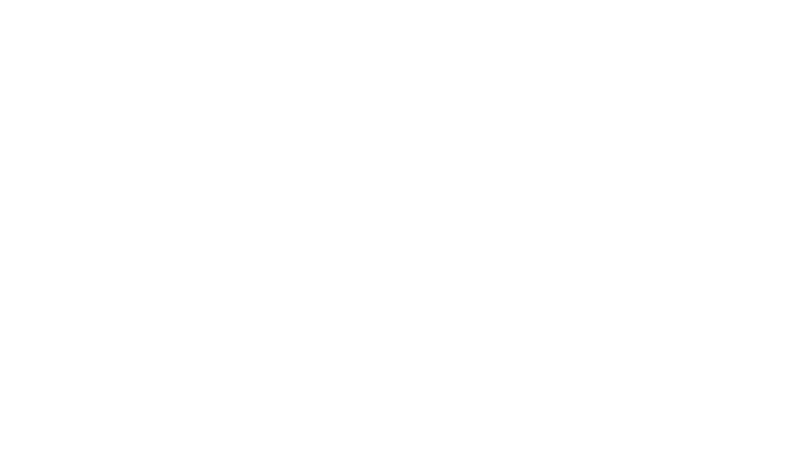
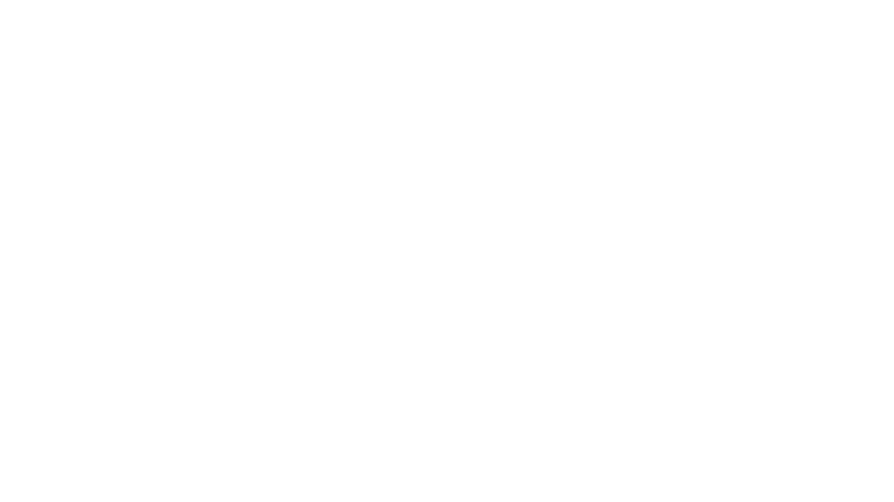
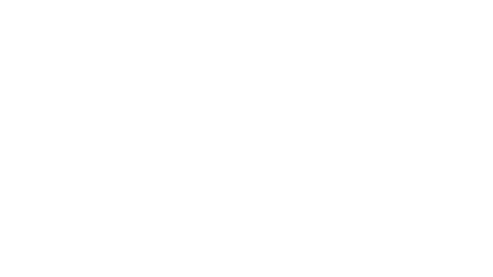
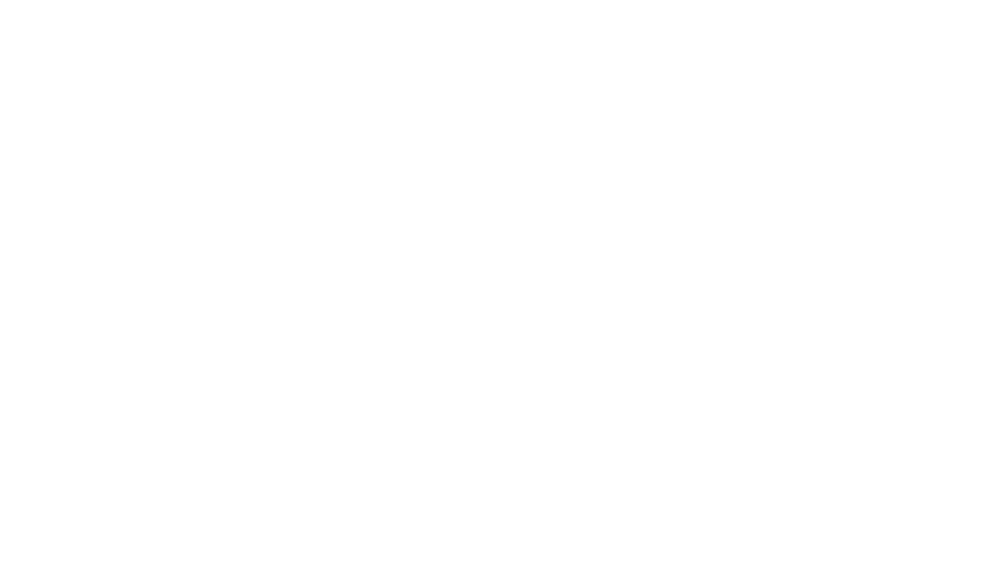
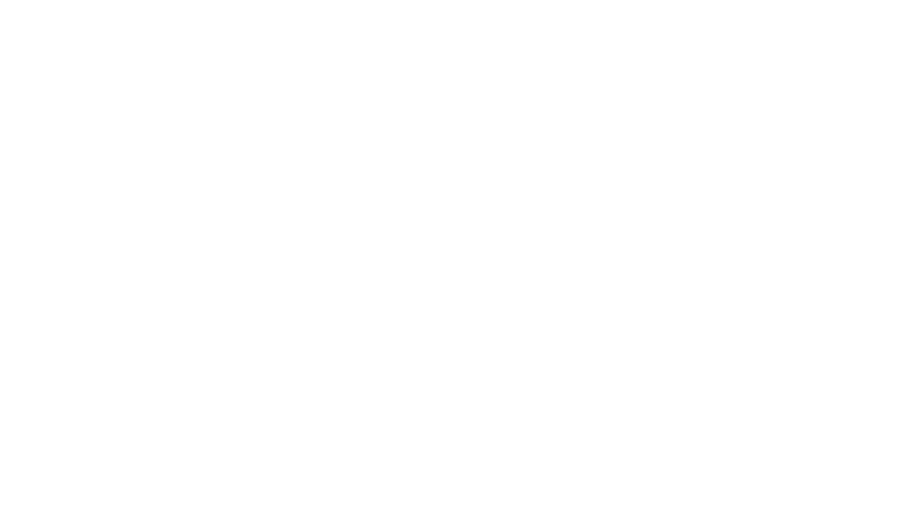
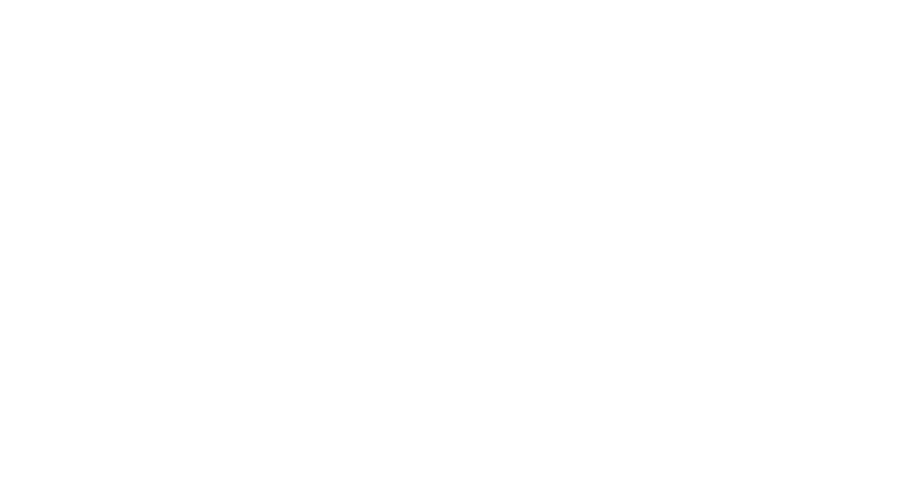
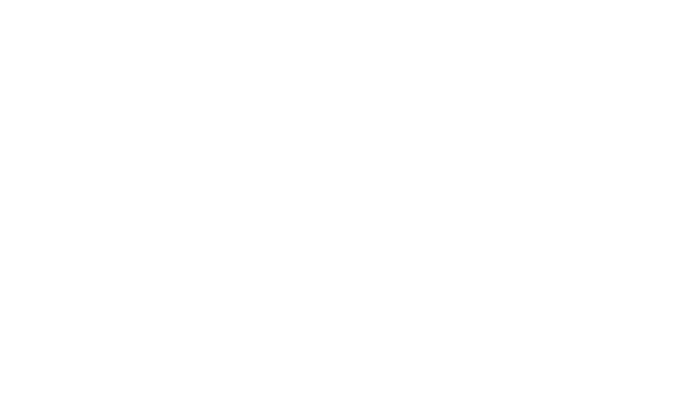
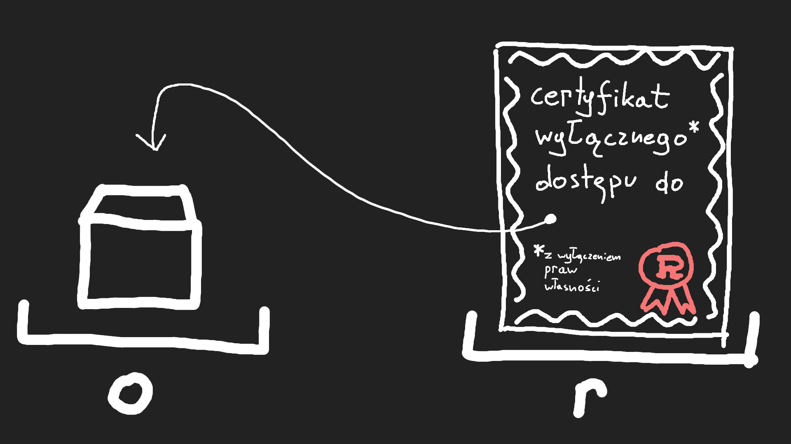

<!--  -->
# Rust

#### fast · reliable · productive <br/> pick three

<br/>

Michał Krasnoborski
<br/>
<small>Codilime TechTalk  11 grudnia 2018</small>

vvv

```rust
if "this_text".is_too_small() {
    scream();
}
```

---

# Plan

1. Wstęp
2. Posiadanie i pożyczanie
3. Przegląd cech języka
4. Czemu Rust (nie) jest idealny?
5. Zalety pozajęzykowe

---

## Czym jest Rust?

```rust
fn main() {
    println!("Witaj, Świecie!");
}
```

Rust to systemowy język programowania,
który jest niesamowicie szybki,
zapobiega naruszeniom pamięci
oraz gwarantuje bezpieczeństwo wątków.
<!-- .element: class="fragment" data-fragment-index="1" -->

vvv

* abstrakcje o zerowym koszcie
* semantyka przenoszenia
* gwarancja bezpieczeństwa pamięci
* wątki bez wyścigów (data races)
* dziedziczenie oparte na cechach
* pattern matching
* inferencja typów
* minimalne środowisko uruchomieniowe
* wydajne bindingi do C

może krócej?
<!-- .element: class="fragment" data-fragment-index="1" -->

vvv

# Rust

* Język kompilowany
* Bez garbage collectora
* Bezpieczny
* Wysokopoziomowy

vvv

### Język kompilowany

* deployment == `scp`
* błędy w czasie kompilacji (nie&nbsp;uruchomienia)

vvv

### Bez garbage collectora

* przewidywalne zachowanie
* łatwość zagnieżdżania w innych językach
    * js (jako wasm)
    * python
    * go
* możliwość zastosowania tam, gdzie C
    * embedded
    * systemy operacyjne
    * high-performance

vvv

### Bezpieczny

* kompilator zabroni niedoświadczonemu programiście mazać po pamięci
    * doświadczonemu też
    * unikniemy luk bezpieczeństwa
* rzadziej sięgamy po debugger

vvv

### Wysokopoziomowy

```rust
use std::io::Read;

fn run() -> Result<()> {
    let mut res = reqwest::get("http://httpbin.org/get")?;
    let mut body = String::new();
    res.read_to_string(&mut body)?;

    println!("Status: {}", res.status());
    println!("Headers:\n{:#?}", res.headers());
    println!("Body:\n{}", body);

    Ok(())
}
```

źródło: [rust-cookbook](https://rust-lang-nursery.github.io/rust-cookbook/web/clients/requests.html)


---

<!-- .slide: data-background="#240"  -->
## Posiadanie i pożyczanie<br/><small>(ownership & borrowing)</small>

* unikalna cecha Rusta <!-- .element: class="fragment"  -->
* wymaga nieco innego modelu myślenia <!-- .element: class="fragment"  -->

---

### Jaki problem chcemy rozwiązać?

#### Wyścigi danych

* wiele wątków, co najmniej jeden pisze <!-- .element: class="fragment" data-fragment-index="1" -->
* dostęp nie jest zsynchronizowany <!-- .element: class="fragment" data-fragment-index="1" -->

* czy tylko przy wielu wątkach?  <!-- .element: class="fragment" -->
* wiele dostępów, jeden z nich pisze <!-- .element: class="fragment" -->

vvv

### Wprowadzamy dwie zasady
* wiele czytających lub jeden piszący
* każdy obiekt ma dokładnie jednego posiadacza
    * bez tego trudno o unikalny dostęp

Note:
W scenariuszu jednowątkowym: w wypadku „bezpiecznych” języków
jesteśmy po prostu zdziwieni (albo mamy błąd logiczny), bo
ktoś nam zmodyfikował obiekt pod nosem.

Np. inwalidacja iteratorów – w C++ może skończyć się katastrofą.

problematyczne, gdy wszystko ma referencję do wszystkiego

Analogia – compile time single threadex mutex

---

## Przenoszenie

```rust
fn main() {
    let v = vec![1, 2, 3];
    let w = v;
}
```


<!-- .element: class="fragment naked medium"  -->

vvv

## ?

```rust
fn main() {
    let v = vec![1, 2, 3];
    let w = v;
    println!("{:?}", v);
}
```

```txt
error[E0382]: use of moved value: `v`
 --> 2-1-move-println.rs:4:22
  |
3 |     let w = v;
  |         - value moved here
4 |     println!("{:?}", v);
  |                      ^ value used here after move
  |
```
<!-- .element: class="fragment"  -->

vvv


<!-- .element: class="naked medium"  -->

Zmienna `v` po przeniesieniu jest pusta,
i nie posiada **żadnej** wartości.
* nie `0`
* nie `nil`
* nie `""`

vvv

<small>(implementacja)</small>

### „Move is always `memcpy`”


<!-- .element: class="naked medium"  -->

vvv


<!-- .element: class="naked medium"  -->

* `memcpy`, ale „płytkie”
* protsze życie dla kompilatora
* proste optymalizacje typu RVO
* jako zwykli użytkownicy nie musimy o tym myśleć <!-- .element: class="fragment"  -->

vvv

<small>(jeszcze raz)</small>
### Przenoszenie

```rust
let w = v;
```


<!-- .element: class="naked medium"  -->

---

### C++

```cpp
int main() {
    auto v = vector<int>{1, 2, 3};
    auto w = move(v);
    cout << v;
}
```


<!-- .element: class="naked medium"  -->

---

#### Python

(także js, java, ruby)

```python
v = [1, 2, 3]
w = v
print(v)
```


<!-- .element: class="naked medium"  -->

---

## Klonowanie

```rust
let v = vec![1, 2, 3];
let mut w = v.clone();
```


<!-- .element: class="naked medium"  -->

```rust
w.push(4);
println!("{:?} {:?}", v, w);
```

vvv

```rust
let x = 41;

let mut y = x.clone(); // ugly!
y += 1;

println!("{} {}", x, y);
```

---

## Kopiowanie

```rust
let x = 42;
let y = x;
println!("{} {}", x, y);
```


<!-- .element: class="fragment naked medium"  -->

vvv

### typy kopiowalne

* `i8` ... `i32`, `isize`
* `u8` ... `u32`, `usize`
* `char`
* `bool`
* referencje współdzielone
* krotki `(T, U, ...)`
* tablice o stałym rozmiarze `[T; X]`
* struktury składające się z powyższych

---

## Pożyczanie
<!-- .slide: data-background="#240"  -->

---

# `&T`
## Referencja współdzielona<br/><small>(shared reference)</small>

```rust
let reference: &SomeType = &some_object;
```

<br/>
<small>Znana także jako referencja niemutowalna
(immutable reference)<br/>
oraz *pożyczka*
</small>

vvv

### `&T`
<small>(referencja współdzielona)</small>

<b>uprawnia:</b><br/>
do patrzenia\* na obiekt

<b>zakazuje:</b><br/>
modyfikacji

<b>zapewnia:</b></br/>
inni też mogą tylko patrzeć<br/>
(podczas gdy referencja istnieje)

</small>

vvv

```rust
let o = SomeObject::new();
let r = &o;
println!("{}", r);
```


<!-- .element: class="naked medium"  -->

---

# `&mut T`
## Referencja unikalna<br/><small>(unique reference)</small>

```rust
let reference: &mut SomeType = &mut some_object;
```

<br/>
<small>Znana także jako referencja mutowalna (mutable&nbsp;reference)<br/>
oraz *unikalna/mutowalna pożyczka*
</small>

vvv

### `&mut T`
<small>(referencja unikalna)</small>

<b>uprawnia:</b><br/>
do modyfikacji

<b>zakazuje:</b><br/>
przesuwania (w tym niszczenia)</br>
<small>(ale można „szybko podmienić”)</small>

<b>zapewnia:</b></br/>
unikalność dostępu

vvv

```rust
let o = SomeObject::new();
let r = &mut o;
println!("{}", r);
```


<!-- .element: class="naked medium"  -->

vvv

#### Referencje jako argumenty

```rust
fn something(a: &mut Vec<u8>, b: &Vec<u8>, c: Vec<u8>) {
    // ...
}

something(&mut a, &b, c);

let r = &b;
something(&mut a, r, c);
```

---

## The Borrow Checker

Sprawdza, czy kod faktycznie zachowuje
wcześniej podane własności `&T` i `&mut T`

vvv

<!-- .slide: data-background="#101808" -->
Wiele dzielonych referencji — ok!

```rust
let s = String::from("abc");

let r1 = &s;
let r2 = &s;

println!("{:?} {:?}", r1, r2);
```

vvv

<!-- .slide: data-background="#180808" -->
Wiszące wskaźniki — nie ok
```rust
fn reference_to_hmmm() -> &str {
    let s = std::fs::read_to_string().unwrap();
    return &s;
    // znika tacka – znika obiekt
}
```

Note: Po prostu usuń `&`.
Also, niepotrzebny return.

vvv

<!-- .slide: data-background="#101808" -->

Nienakładające się unikalne dostępy — ok!

```rust
let s = String::from("abc");

let unique1 = &mut s;
unique1.push('d');

let unique2 = &mut s;
unique2.push('e');

println!("{}", s); // abcde
```

vvv

<!-- .slide: data-background="#180808" -->
Inwalidacja iteratorów — nie ok
```rust
let mut things = vec![1, 2, 300, 4, 5];

let favourite = &things[0];
let best = things.iter().max();

things.clear();

println!("{:?} {}", best, favourite);
```
(złamaliśmy zasadę unikalności)

Note: jednowątkowy wyścig

vvv

<!-- .slide: data-transition="zoom"  -->

### „Lifetimes”

Czas życia, ale czego?

`&T`
<!-- .element: class="fragment"  -->

`&'a T`
<!-- .element: class="fragment"  -->

<p>`'a` — „kontekst pożyczki”</p>
<!-- .element: class="fragment"  -->

vvv

<!-- .slide: data-transition="zoom"  -->

```rust
fn choose<'a>(left: &'a str, right: &'a str) -> &'a str {
    if flip_a_coin() { left } else { right }
}

fn main() {
    let good = get_good_string();
    let mut bad = get_bad_string();
    let chosen = choose(&good, &bad);

    bad.clear();
    println!("{:?}", chosen);
}
```

<small>`split::<'{pożyczone: good i bad}>(&good, &bad);`</small>
<!-- .element: class="fragment"  -->
<br/>
<small>`chosen: &str`</small>
<br/>
<!-- .element: class="fragment"  -->
<small>`chosen: &'{pożyczone: good i bad} str`</small>
<!-- .element: class="fragment"  -->

Note: NLL zmieniło algorytm na trochę bardziej zaawansowany

vvv

### `'a` — kontekst pożyczki

* na szczęście, potrzebny raczej tylko w&nbsp;wyjątkowych przypadkach
* kompilator wstawia domyślne anotacje

```rust
fn get_x(&self)              -> &X    { self.X }
fn get_x<'a>(&'a self)       -> &'a X { self.X }
```

```rust
fn get_x<'a>(self: &'a Self) -> &'a X { self.X }
```
<!-- .element: class="fragment"  -->

---

## Zasady zbyt drastyczne?
<!-- .slide: data-background="#240"  -->

Co jeśli chcemy mieć wielu posiadaczy lub&nbsp;wiele&nbsp;dostępów do odczytu?

---

## Współdzielone posiadanie

vvv

### `Rc<T>`

* wiele uchwytów do tego samego obiektu
* ostatni sprząta
* pozwala otrzymać referencję współdzieloną (&T)

```rust
let v = vec![1, 2, 3];
let rc1 = Rc::new(v);
let rc2 = rc1.clone(); // kopiujemy tylko uchwyt, nie dane

println!("{:?} {:?}", rc1, rc2);

// rc1.push(4); // nie możemy psuć współdzielonych danych!
```

vvv

### `Arc<T>`

wielowątkowy starszy brat `Rc`

używa operacji atomowych do modyfikacji licznika referencji

---

## Współdzielona modyfikacja

vvv

### `Cell<T>`

```rust
let shared = Cell::new(1);

let ref1 = &shared;
let ref2 = &shared;

ref2.set(42);

println!("{}", ref1.get()); // 42
```

<br/>
<p>Dostęp tylko poprzez `get` i `set`</p>
<!-- .element: class="fragment"  -->

Specjalny typ znany kompilatorowi\*
<!-- .element: class="fragment"  -->

Note:
Tak naprawdę, kompilator zna `UnsafeCell`, natomiast `Cell` i `RefCell`
to implementacja.

vvv

### `RefCell<T>`

„Runtime borrow checker”

Dostęp poprzez `borrow` i `borrow_mut`.

vvv

### `Mutex<T>` i `RwLock<T>`

Nie pozwalają na dostęp do obiektu bez zawołania `lock`.

Note: lockguard, RAII

vvv

### `AtomicU32` i przyjaciele

---

### Współdzielone posiadanie z&nbsp;możliwością modyfikacji?

Wspominaliśmy, że `Rc` nie pozwala na modyfikację danych...

vvv

Typy „opakowujące” można łączyć!

```rust
use std::rc::Rc;
use std::cell::RefCell;

fn main() {
    let v = vec![1, 2, 3];
    let rc1 = Rc::new(RefCell::new(v));
    let rc2 = rc1.clone();

    rc2.borrow_mut().push(4);

    println!("{:?} {:?}", rc1, rc2);

    // let reference: &i32 = &rc1.borrow()[0]; // zabronione
}
```

vvv

<!-- .slide: data-background="#123"  -->
#### Dygresja

referencja dzielona ==? mutowalna?

* dla większości zwykłów typów – tak
    * `i32`, `char`, `bool`, `String`, `Vec`, kolekcje, pliki, strumienie

* istnieją typy pozwające na mutowanie przez referencję dzieloną (`&T`)
    * zapewniają, że mutacja jest bezpieczna

vvv

`Rc<RefCell<T>>` daje semantykę podobną do pythona.

<!-- ########################################################################################## -->
<!-- ########################################################################################## -->
<!-- ########################################################################################## -->

---

<!-- .slide: data-background="#240"  -->
## Przegląd cech języka

---

## Cechy<br/><small>(traits)</small>

vvv

Cechy – podobne do interfejsów

```rust
trait Quack {
    fn quack(&self);
}
```

```rust
trait ToString {
    fn to_string(&self) -> String;
}
```


(ale nie tylko)
<!-- .element: class="fragment"  -->

---

### Cechy — implementacja

```rust
struct Duck {
    quacks_per_second: u32,
}
```

```rust
trait Quack {
    fn quack(&self);
}
```

```rust
impl Quack for Duck {
    fn quack(&self) {
        for _ in 0..self.quacks_per_second {
            println!("quack");
        }
    }
}
```
<!-- .element: class="fragment"  -->

vvv

### Dygresja – metody

```rust
struct S {
    s: u32,
    c: char,
}

impl S {
    fn do_something(&self) { /* ... */ }

    fn new() -> S { /* ... */ }
}
```

vvv

Implementacja dla typów wbudowanych?

Pewnie!

```rust
impl Quack for String {
    fn quack(&self) {
        println!("Quack, {}, {}, quack!", self, self);
    }
}
```

Note: Lattice rule :P

---

### Trait bounds<br/><small>(ograniczanie cechami?)</small><br/>

```rust
fn quack_twice(quacker: impl Quack) {
    quacker.quack();
    quacker.quack();
}
```

<small>czytaj — quacker: jakaś implementacja `Quack`</small>

vvv

#### Monomorfizacja

```rust
fn quack_twice(quacker: impl Quack) {
    quacker.quack();
    quacker.quack();
}
```

```rust
quack_twice(Duck { quacks_per_second: u32 });
quack_twice(String::from("blo"));
```

```rust
fn quack_twice_Duck(quacker: Duck);
fn quack_twice_String(quacker: String);
```
<!-- .element: class="fragment"  -->

Zagadka <!-- .element: class="fragment"  -->
```rust
quack_twice(5);
```
<!-- .element: class="fragment"  -->

vvv

```rust
fn quack_twice(quacker: impl Quack) {
    // ...
}
```

```rust
fn quack_twice<Q: Quacker>(quacker: Q) {
    // ...
}
```

```
fn quack_twice<Q>(quacker: Q)
where Q: Quack {
    // ...
}
```

---

### Dynamiczne obiekty cech<br/><small>(dynamic trait objects)</small>

```rust
fn quack_twice_dyn(quacker: &dyn Quack) {
    quacker.quack();
    quacker.quack();
}
```

Dynamiczny obiekt kwaczący

vvv

Kompatybilny z różnymi wskaźnikami:

* `&dyn Quack`
* `Box<dyn Quack>`
* `Rc<dyn Quack>`
* `Arc<dyn Quack>`

vvv

<small>(implementacja)</small>

#### Gruby wskaźnik<br/><small>(fat pointer)</small>

1. wskaźnik do obiektu właściwego (`&Duck`)
2. wskaźnik do tablicy funkcji wirtualnych

<br/>
Zero narzutu na implementację interfejsu!
<!-- .element: class="fragment" -->

---


### Cechy bez metod?

vvv

### `Copy`

cecha kopiowalności

typ bezkarnie kopiowalny
(kartka papieru)

```rust
let x = 1;
let copy1 = x;
let copy2 = x;
```

<br/>
```rust
fn i_want_easy_copying<T>(data: &mut[T])
    where T: Copy
{
    // ...
}

```
<!-- .element: class="fragment"  -->

vvv

### `Send`

cecha wysyłalności

typ bezpieczny do przeniesienia do innego wątku

* ma ją większość obiektów
<!-- .element: class="fragment" data-fragment-index="1" -->
* nie ma jej np. Rc
<!-- .element: class="fragment" data-fragment-index="1" -->

Note:
shared\_ptr w C++ – dlaczego w Ruście są Rc i Arc.

vvv

### `Sync`

„wszystkie dostępy przez współdzieloną referencję `&T`
mogą być prowadzone z wielu wątków”

* ma ją większość obiektów <!-- .element: class="fragment" data-fragment-index="1" -->
    * bo mogą tylko czytać <!-- .element: class="fragment" data-fragment-index="1" -->
* także <!-- .element: class="fragment" data-fragment-index="1" --> `Mutex`
* <!-- .element: class="fragment" data-fragment-index="1" -->nie mają jej `Cell` i `RefCell`. 

---

### Co jeszcze potrafią cechy?

vvv

#### `Self` i domyślne implementacje

```rust
trait Clone {
    fn clone(&self) -> Self;

    fn clone_from(&mut self, source: &Self) {
        *self = source.clone();
    }
}
```

vvv

#### Typy powiązane<br/><small>(associated types)</small>

```rust
trait Iterator {
    type Item;

    // ...
}
```

---

## Wszystko jest wyrażeniem

```rust
let x = if condition { 1 } else { 2 };
```

vvv

```rust
fn foo() -> i32 {
    println!("calling foo");
    42
}
```

pętle też!

```rust
let awesome = loop {
    let thing = get_thing()
    if thing.is_awesome() {
        break thing;
    }
};
```

---

## Wyliczenia i pattern matching

```rust
enum Expr {
    Add(Box<Expr>, Box<Expr>),
    Number(i32),
    Ask,
}
```

```rust
fn eval(&self) -> i32 {
    match self {
        Expr::Add(a, b)  => a.eval() + b.eval(),
        Expr::Number(&x) => x,
        Expr::Ask        => read_input(),
    }
}
```

vvv

### Wbudowane wyliczenia

```rust
enum Option<T> {
    Some(T),
    None,
}
```

```rust
enum Result<T, E> {
    Ok(T),
    Err(E),
}
```

vvv

### Obsługa błędów

```rust
fn get_answer() -> Result<String, io::Error> {
    let answer = match fs::read_to_string("answer.txt") {
        Ok(a) => a,
        Err(e) => return Err(e),
    };
    format("answer is {}", answer)
}
```

```rust
fn get_answer() -> Result<String, io::Error> {
    let answer = fs::read_to_string("answer.txt")?;
    format("answer is {}", answer)
}
```

vvv

### Bonus — fizzbuzz

```rust
fn fizzbuzz(x: u32) {
    match (x % 3, x % 5) {
        (0, 0) => println!("FizzBuzz"),
        (0, _) => println!("Fizz"),
        (_, 0) => println!("Buzz"),
        _      => println!("{}", x),
    }
}
```

---

## Unsafe

biblioteka standardowa Rusta jest napisana w Ruście
<!-- .element: class="fragment"  -->

jak?
<!-- .element: class="fragment"  -->

vvv

### Unsafe

#### Ciemna strona Rusta

Pozwala na używanie nagich wskaźników
(czyli jak w C),

vvv

### Unsafe — dwie strony

1. `unsafe fn` i `unsafe trait` — RTFM

2. `unsafe` block

   ```rust
   // Dear compiler, this is safe, trust me
   unsafe {
       // Do some magic
   }
   ```

vvv

* Łatwiesze review codu
* `unsafe` można schować w modułach za bezpieczną warstwą abstrakcji

---

## Makra

```rust
macro_rules! double {
    ($x:expr) => {
        2 * $x
    }
}

assert_eq!(double!(2 + 2), 8)
```

vvv

### Makra — higiena

```rust
macro_rules! double {
    ($x:expr) => {
        {
            let a = 2;
            a * $x
        }
    }
}

let a = 3;
assert_eq!(double!(a), 6)
```

vvv

### „macro by example”

```rust
macro_rules! map {
    ( $( $key:expr => $value:expr ),* ) => {
        {
            let mut m = HashMap::new();
            $(
                m.insert($key, $value);
            )*
            m
        }
    };
    (...) => { map!("foo" => "bar"); }
}

let m = map!("a" => 1, "b" => 2);
```

vvv

### Makra

także proceduralne

oraz w postaci atrybutów (dekoratorów)

---

## Iteratory

```rust
for (i, word) in s.split_whitespace().take(3).enumerate() {
    println!("{}: {}", i, word);
}
```

Iteratory są leniwe
<!-- .element: class="fragment" data-fragment-index="1" -->

```rust
trait Iterator {
    type Item;
    fn next(&mut self) -> Option<Item>;
}
```
<!-- .element: class="fragment" data-fragment-index="1" -->

<p><small>`SplitWhitespace::next` wywoła się dokładnie 3 razy</small></p>
<!-- .element: class="fragment" data-fragment-index="2" -->

vvv

```rust
fn dot_product(xs: &[u32], ys: &[u32]) -> u32 {
    xs.iter()
        .zip(ys)
        .map(|(x, y)| x * y)
        .sum()
}
```

Ten kod się wektoryzuje!
<!-- .element: class="fragment"  -->

---

<!-- .slide: data-background="#322" -->
## Czemu Rust nie jest idealny?

---

<!-- .slide: data-background="#322"  -->
### Restrykcyjność kompilatora 

Utrudnia prototypowania

<!-- .slide: data-background="#322"  -->
vvv

#### ale...

ale mamy dużą szansę,<br/>że skompilowany kod zadziała

z czasem zauważamy błędy<br/>zanim zrobi to kompilator  
<!-- .element: class="fragment"  -->

---

<!-- .slide: data-background="#322"  -->
### Krzywa uczenia

... to raczej ściana
<!-- .element: class="fragment"  -->

vvv

<!-- .slide: data-background="#322"  -->
Pewne rzeczy Rust robi inaczej

Rust to nie tylko nowa składnia + kilka ficzerów
<!-- .element: class="fragment"  -->

vvv

#### ale...

Most loved programming language!

<small>(wg. ankiety Stack Overflow)</small>

Czyli chyba warto
<!-- .element: class="fragment"  -->

---

### Programowanie obiektowe i Rust

<!-- .slide: data-background="#322"  -->
Nie wszystkie wzorce dają się łatwo przetłumaczyć

vvv

#### „Programowanie obiektowe”

<!-- .slide: data-background="#322"  -->
* Wirtualne hierarchie klas
* Wskaźniki z wszystkiego na wszystko

vvv

#### ale...

* wyliczenia (`enum`)
* cechy (`traits`)
* data-oriented programming też jest fajne!

---

### Niedojrzały ekosystem?

<!-- .slide: data-background="#322"  -->

Minęły trzy lata od wersji 1.0
<!-- .element: class="fragment"  -->

Można znaleźć bibliotekę niemal do wszystkiego
<!-- .element: class="fragment"  -->

---

<!-- .slide: data-background="#231"  -->
## Cargo

Menedżer ~~pakietów~~ zależności


<!-- .element: class="naked cargo-sized"  -->

vvv

<!-- .slide: data-background="#231"  -->
### `cargo new`

```bash
$ cargo new hello
```

```sh
hello/
├── Cargo.toml
└── src
    └── main.rs

```

```toml
[package]
name = "hello"
version = "0.1.0"
authors = ["Michał Krasnoborski <redacted@redacted.com>"]
edition = "2018"

[dependencies]
```

vvv

<!-- .slide: data-background="#231"  -->
### Przykład

```toml
[dependecies]
rayon = "1.0.0"
```

```rust
use rayon::prelude::*;

fn main() {
    let input: Vec<_> = (0..1000).collect();
    let results: Vec<_> = input
        .par_iter()
        .map(calculate_thing)
        .collect();
    println!("{:#?}", results);
}
```
<!-- .element: class="fragment"  -->

```sh
cargo run --release
```
<!-- .element: class="fragment"  -->

```sh
cargo build --release
```
<!-- .element: class="fragment"  -->

vvv

<!-- .slide: data-background="#231"  -->
### Narzędzia

* `cargo fmt`
* `cargo fix`
* `cargo clippy`
* `cargo test`

```rust
#[test]
fn it_works() {
    assert_eq!(2 + 2, 4);
}
```

vvv

<!-- .slide: data-background="#231"  -->
### Cargo — robisz to dobrze

* Registry nie pozwala usuwać paczek
* Mrożenie zależności — `Cargo.lock`
* Zależność w różnych wersjach — ok!
* Izolowane projekty

---

<!-- .slide: data-background="#133" -->
## Społeczność

<!-- .slide: data-background="#133" -->
vvv

<!-- .slide: data-background="#133" -->
### Mili ludzie

odpowiedzą na każde pytanie<br/>
<small>(nawet głupie)</small>

* IRC
* `reddit.com/r/rust`
* Discord
* `users.rust-lang.org`
* meetupy

vvv

<!-- .slide: data-background="#133" -->
### Materiały

* The Rust Programming Language
* Programming Rust — O’Reilly
* Rust by example
* Rust cookbook

---

<!-- .slide: data-background="#321" -->
## Zastosowania

vvv

<!-- .slide: data-background="#321" -->
### Web backend

```rust
#![feature(proc_macro_hygiene, decl_macro)]

#[macro_use] extern crate rocket;

#[get("/hello/<name>/<age>")]
fn hello(name: String, age: u8) -> String {
    format!("Hello, {} year old named {}!", age, name)
}

fn main() {
    rocket::ignite().mount("/", routes![hello]).launch();
}
```

vvv

<!-- .slide: data-background="#321" -->
### Web frontend

(w celu poprawy wydajności)

Webassembly (WASM)
<!-- .element: class="fragment"  -->

vvv

<!-- .slide: data-background="#321" -->
### Embedded & OS

<br/>
#### redox-os

<br/>
#### Discovery — książka
ARM Cortex-M µC

vvv

<!-- .slide: data-background="#321" -->
### Zagnieżdżanie w innych językach<br/><small>(embedding)</small>

```toml
[lib]
crate-type = ["cdylib"]
```

Tworzy bibliotekę bez dodatkowych zależności

<p>`bindgen`, `wasm-bindgen`, etc.</p>
<!-- .element: class="fragment"  -->

vvv

<!-- .slide: data-background="#321" -->
### CLI

```rust
/// Read some lines of a file
#[derive(Debug, StructOpt)]
struct Cli {
    /// Input file to read
    file: String,
    /// Number of lines to read
    #[structopt(short = "n")]
    num: usize,
}
```

vvv

<!-- .slide: data-background="#321" -->
### Wydajna, bezpieczna wielowątkowość


<br/>
Servo

Firefox

vvv

<!-- .slide: data-background="#321" -->
### Kto używa Rusta?

* Mozilla
* Tilde
* Chucklefish
* Dropbox
* Yelp
* Anixe

...
<!-- .element: class="fragment"  -->

Ty?
<!-- .element: class="fragment"  -->

---

## Dziękuję za uwagę

Pytania?
<!-- .element: class="fragment"  -->

<small>
Slajdy pojawią się na `github.com/krdln/rust-2018-slides`
</small>
<!-- .element: class="fragment"  -->
<small>
Learn more: https://www.rust-lang.org
</small>
<!-- .element: class="fragment"  -->
<small>
Zapraszamy na piwo, pizzę i do wypełnienia ankiet!
</small>
<!-- .element: class="fragment"  -->

<br/>
<br/>

<!-- .element: class="naked smol"  -->
